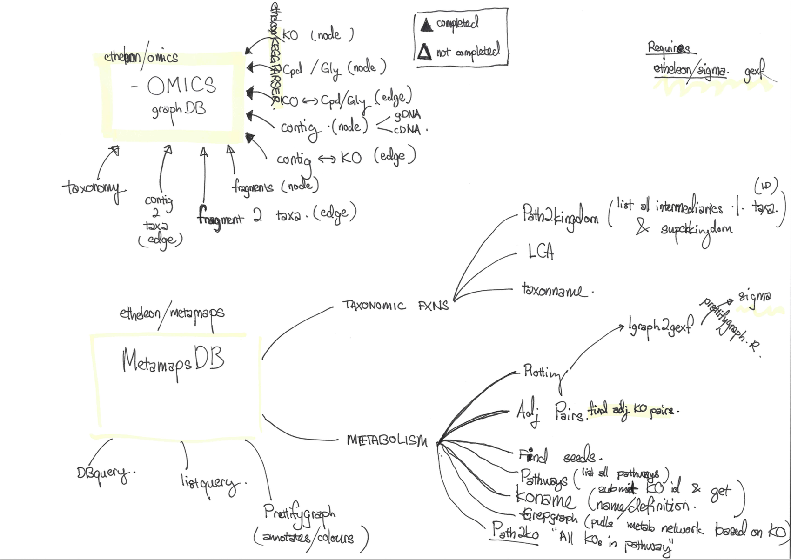

Meta4j
====

## Introduction 

**Meta4J** is a CLI tool for creation of a integrated `-omics` graph database used for data warehousing a integrated `-omics` microbial communities project.

It is designed to be modular, from simple projects involving only genomics data to multiple `-omics` datasets. It aims to integrate with existing databases for annotation cross refering (metadata)

> Modularity - Still in progress
> Currently supports the creation of a metabolic network integrated with KO data. 

## Origin

Meta4j was created by Wesley in the course of his PhD to address issues surrounding the storage and integration of -omics datasets and accompanying metadata databases Facilitating the interrogration of highly nested biological questions.

Further design of analytic tools are designed by Wesley **GOI**, Chao **XIE** and Peter **LITTLE**. 

## Purpose

Meta4j aims to be a highly customizable database for researchers to store and query interconnected data. 

## Installation




Before attempting to prepare your own customized version of the Meta4j database please take time to install the necessary dependencies. (See Dependencies section).
 
Scripts are organised into 2 categories:

1. The generation of tables files `relationships` and `nodes` for batch insertion into Neo4j graph database. Found in the `script` folder
2. Creation and starting of neo4j graph database. (dot DB file)

__OMICS__
now currently uses a submodule [keggParser](https://github.com/etheleon/keggParser). 
Run the following commands after cloning this repository to clone `keggParser`.

```
$ git submodule init
$ git submodule update
```

[git documentation on submodules](https://git-scm.com/book/en/v2/Git-Tools-Submodules)

> Here we’ll clone a project with a submodule in it.
> When you clone such a project, by default you get the directories that contain submodules, 
> but none of the files within them yet:

**NOTE**: For accessing the database and functions used in the analytical pipeline use the `MetamapsDB` R package from [MetamapsDB](https://github.com/etheleon/metamaps).

## Usage

```
eg. 
$ ./configure.pl --dataSet=taxonomy --dataSet=contig --dataSet=metabolism -c=out/miscDB -ftp --user=<keggFTP username> --password=<keggFTP password>
```

Edit `neo4j-server.properties` and point database to `<outputDIR/out/database/<database.db>`


## Data Components

- KEGG (Functional Database)
- NCBI’s Taxonomy database
- Relative abundance (gDNA and cDNA)
- CONTIG data (diversity sampling using *pAss*)

### KEGG (Functional Database)

Generated from 4 files:


from the KEGG database (use the following commands to download the necessary files from KEGG ftp):

| File | description |
| ---- | ---- |
|`/kegg/genes/ko.tar.gz`| KO details |
|`/kegg/ligand/compound.tar.gz` | Ligand:CPD details| 
|`/kegg/ligand/glycan.tar.gz` | Ligand:GLY details |
|`/kegg/xml/kgml/metabolic/ko.tar.gz` | network properties |
|`/kegg/xml/kgml/metabolic/ko.tar.gz` | module data |

### Taxonomy

this requires a prototype DB to be generated first, (available script but not consolidated yet)
XC's taxon list doesnt have a taxid, I need to associate taxid with name.

TO-DO:
[ ] deal with redundancy in taxonomy, 
[ ] option to just include things in archaea and bacteria

### Relative Abundance


### Contig Data

Requires the contigs to be provided in the following manner:
contig:string:contigid, l:label [...optional Columns]


#### Nodes

```
contig:string:contigid  cDNAFreq:double  cDNAFPKM:double    gDNAFreq:double  gDNAFPKM:double      l:label
K00001:contig00002      1                0.735646998316564  535              8.59366116025439     contigs
K00001:contig00004      1                0.847019850651342  66               1.22065378091888     contigs
K00001:contig00005      1                0.864235701274337  18               0.33967195012266     contigs
K00001:contig00007      1                1.00283954015796   33               0.722604007100565    contigs
K00001:contig00008      2                1.9869344160139    9                0.195232008715361    contigs
K00001:contig00010      2                2.22619876977473   105              2.5519855938535      contigs
K00001:contig00011      1                1.10156467623568   239              5.74861043048696     contigs
K00001:contig00014      2                2.08433316189693   45               1.02401102610508     contigs
K00001:contig00015      1                1.05248506194796   46               1.05713085467217     contigs
```

#### Edges

contig:string:contigid  ko:string:koid [... optional columns]
```
contig:string:contigid  ko:string:koid
K00001:contig00002      ko:K00001
K00001:contig00004      ko:K00001
K00001:contig00005      ko:K00001
K00001:contig00007      ko:K00001
K00001:contig00008      ko:K00001
K00001:contig00010      ko:K00001
K00001:contig00011      ko:K00001
K00001:contig00014      ko:K00001
K00001:contig00015      ko:K00001
```


## Prerequisites

### Abundance data
Users will have to run a blastx aligner (eg. [rapsearch2](http://omics.informatics.indiana.edu/mg/RAPSearch2/), [diamond](https://github.com/bbuchfink/diamond/)) 
against a protein sequence database for detecting remote homologies.

### Installation`
Using `linuxbrew` is highly recommended for either rapsearch2 or diamond

If you’re building diamond on a older server please mail the author at wesley@bic.nus.edu.sg for the binary.

## Dependencies

* Perl  > 5.10;
* R     > v3.1.1 is required
* NEO4J > 2.2
  * Manual Installation
    * Linux [installation](http://neo4j.com/download/)
    * OSX [Installation](http://neo4j.com/download/)

  * Brew package manager
    * [brew](http://brew.sh/)) for OSX
    * [linuxbrew](https://github.com/Homebrew/linuxbrew) for linux

NOTE: dmg version hosted on neo4j does not work

```
brew install neo4j
```

## Publication
(not published yet)


## OS Support

* linux 
* Mac OSX 


