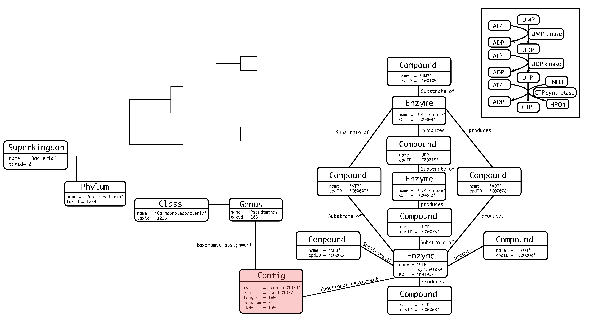
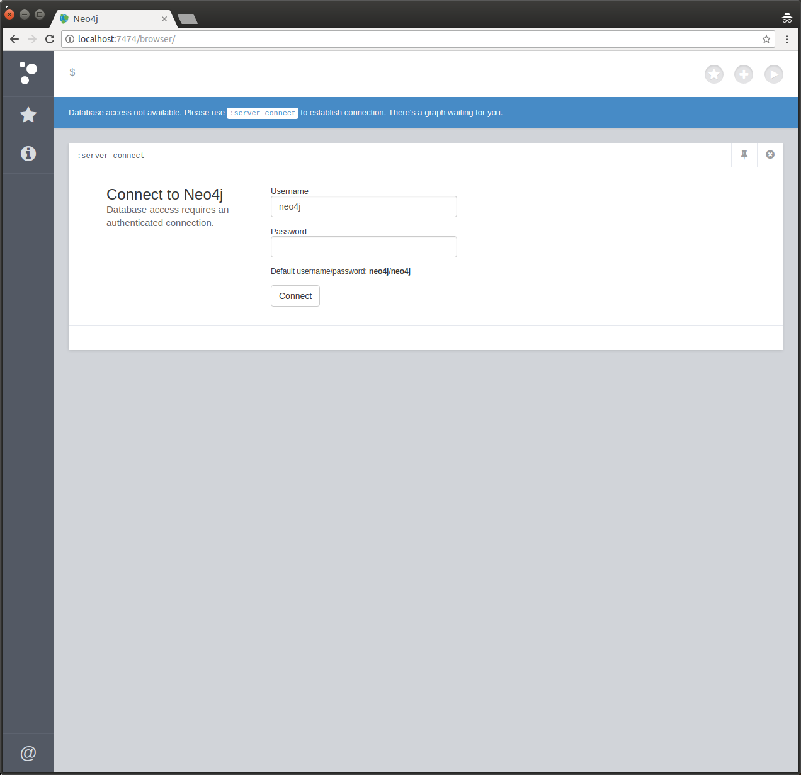
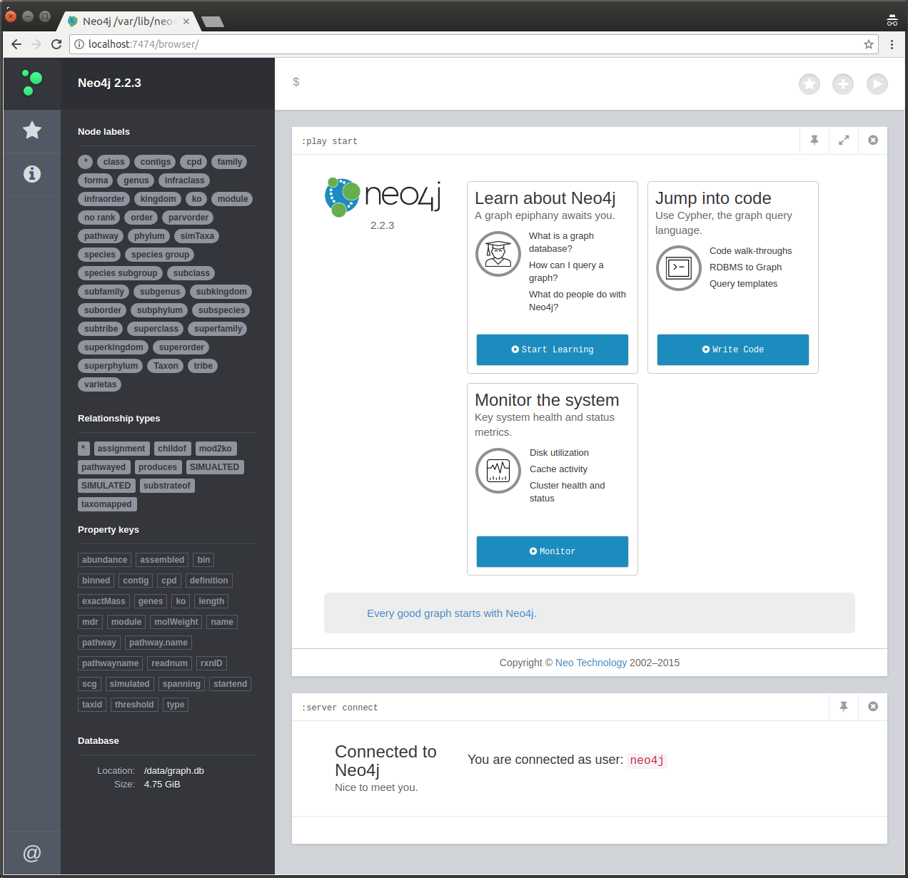

[](https://zenodo.org/badge/latestdoi/19045/etheleon/omics)
[](https://microbadger.com/images/etheleon/metaomicsgraphdb "Get your own image badge on microbadger.com")
[](https://microbadger.com/images/etheleon/metaomicsgraphdb "Get your own version badge on microbadger.com")


## Graph Data Model



## Setup DB (wo Docker)

Clone the repository.

```
$ git clone --recursive git@github.com:etheleon/omics.git
```

Batch import data into single `<database.db>` file.

```
$ ./configure -d=contig -d=metabolism -d=taxonomy -t=10 \
    -x=$HOME/db/taxonomy \
    -j=$HOME/local/neo4j-community-2.2.2/bin/neo4j-import \
    -c=$HOME/contigs \
    -ftp --user=<keggFTP username> --password=<keggFTP password>
```

Edit `org.neo4j.server.database.location=/graph/db` to `org.neo4j.server.database.location=</path2/meta4j/out/database/database.db>` in `neo4j-server.properties`.

## Dependencies

| Software | Version / Packages / etc                                                                             |
| ----     | ----                                                                                                 |
| Perl     | > 5.10                                                                                               |
| R        | > v3.1.2 is required and the following packages (dplyr igraph XML magrittr)                          |
| neo4j    | 2.2.3 (JAVA; `JAVA_HOME` has to be defined in your `$HOME/.bashrc` else `NEO4J-import` will not work |

## External datasets

* NCBI taxonomy (download on your own)
* KEGG FTP (optional)

## Setup DB (with Docker)


## Running the DB (Docker)

You'll need to have [Docker](https://docs.docker.com/engine/installation/) installed.

```
#Run the Docker container
data=$PWD/$DB
docker run \
    --name omics
    --publish=7474:7474 --publish=7687:7687 \
    --volume=$data:/data \
    etheleon/omics-neo4j-container:latest
```

Database needs to be mounted, make sure you have the following folder structure. where graph.db is the output

```
/projectFolder
└── graph.db
    ├── bad.log
    ├── index
    ├── messages.log
    ├── neostore
    ├── neostore.counts.db.a
    ├── neostore.counts.db.b
    ├── neostore.id
    ├── neostore.labeltokenstore.db
    ├── neostore.labeltokenstore.db.id
    ├── neostore.labeltokenstore.db.names
    ├── neostore.labeltokenstore.db.names.id
    ├── neostore.nodestore.db
    ├── neostore.nodestore.db.id
    ├── neostore.nodestore.db.labels
    ├── neostore.nodestore.db.labels.id
    ├── neostore.propertystore.db
    ├── neostore.propertystore.db.arrays
    ├── neostore.propertystore.db.arrays.id
    ├── neostore.propertystore.db.id
    ├── neostore.propertystore.db.index
    ├── neostore.propertystore.db.index.id
    ├── neostore.propertystore.db.index.keys
    ├── neostore.propertystore.db.index.keys.id
    ├── neostore.propertystore.db.strings
    ├── neostore.propertystore.db.strings.id
    ├── neostore.relationshipgroupstore.db
    ├── neostore.relationshipgroupstore.db.id
    ├── neostore.relationshipstore.db
    ├── neostore.relationshipstore.db.id
    ├── neostore.relationshiptypestore.db
    ├── neostore.relationshiptypestore.db.id
    ├── neostore.relationshiptypestore.db.names
    ├── neostore.relationshiptypestore.db.names.id
    ├── neostore.schemastore.db
    ├── neostore.schemastore.db.id
    ├── neostore.transaction.db.21
    ├── neostore.transaction.db.22
    ├── neostore.transaction.db.23
    ├── neostore.transaction.db.24
    ├── neostore.transaction.db.25
    ├── neostore.transaction.db.26
    ├── neostore.transaction.db.27
    ├── rrd
    ├── schema
    └── store_lock
```

After starting the container navigate to `127.0.0.1:7474` on your machine's browser



